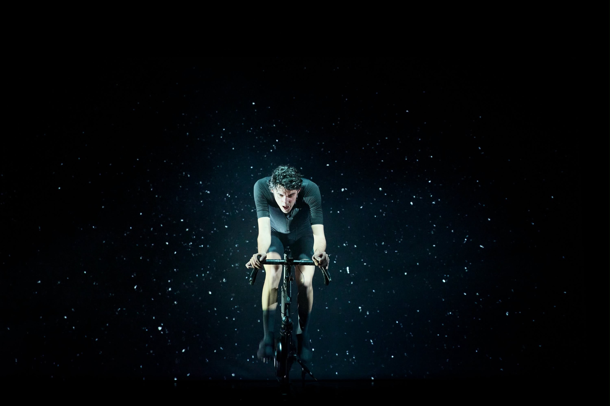
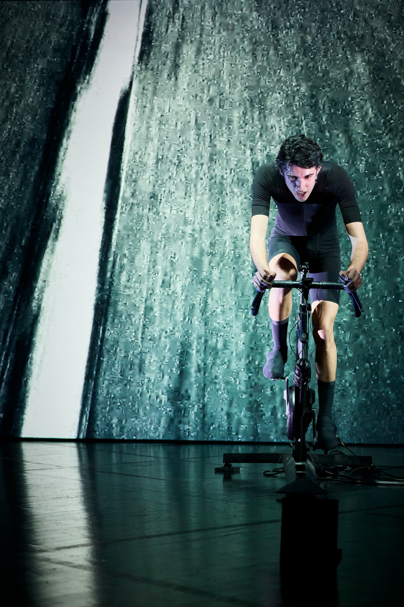

<!--
NOTES DE RÉDACTION (à supprimer avant publication)
- Partenariat : formulation reprise de la page « Nos ambassadeurs » (artifact ProBikeStock).
- Restent entre [crochets] : parcours amateur détaillé, prochaines dates, citation de Léo, crédit photo.
- Crédit photo obligatoire : les deux photos proviennent visiblement d'une captation du spectacle.
  Vérifier l'autorisation de diffusion auprès du photographe et de la compagnie (En Votre Compagnie).
- Faire relire l'article à Léo Gardy avant publication (citations, parcours sportif, raison de l'arrêt).
-->

# Léo Gardy, le forcené : du peloton aux planches, un coureur qui n'a jamais arrêté de pédaler

*Léo Gardy dans* Forcenés*, mise en scène Jacques Vincey. © [crédit photo]*

Un homme, un vélo, un rouleau. Pas de départ, pas d'arrivée, pas de ligne blanche. Pendant tout le spectacle, Léo Gardy pédale. Il ne descend jamais de sa machine. Derrière lui défilent Anquetil, Coppi, Hinault, Ocaña ; devant lui, une salle qui retient son souffle pendant que le sien s'accélère.

Chez ProBikeStock, on a vu beaucoup de vélos passer entre nos mains. On n'en avait jamais vu un raconter un siècle entier. C'est pour ça qu'on a voulu faire route avec Léo.

---

## 🚴 Qui est Léo Gardy ?

### Un coureur avant tout

Comédien, auteur et ancien cycliste, Léo Gardy a 31 ans. Il a grandi dans le vélo et a couru en compétition sur route, avec un objectif clair : passer professionnel. Selon les termes de la presse qui a suivi son parcours, il a longtemps été considéré comme **un jeune espoir du cyclisme français**.

Un problème de santé important l'a contraint à renoncer à la carrière de haut niveau qu'il visait. Pour un coureur, c'est le scénario le plus dur : les jambes sont là, l'envie aussi, mais le corps dit stop.

[À COMPLÉTER avec Léo (facultatif) : clubs, catégorie atteinte, meilleurs résultats, âge au moment de l'arrêt.]

### Puis le théâtre

Léo ne s'est pas éloigné du vélo. Il a changé de terrain. Il se forme comme comédien à l'**École Kourtrajmé** (programme théâtre, Lab14 au Théâtre 14, Paris), où il a notamment pour professeur le metteur en scène **Jacques Vincey**, ancien directeur du Centre dramatique national de Tours (Théâtre Olympia).

C'est de cette rencontre qu'est né le projet qui a fait de lui, en 2026, l'une des révélations théâtrales majeures de l'année, grâce à une performance à la fois scénique et athlétique hors norme.

---

## 🎭 L'aventure actuelle : *Forcenés*

*La vidéo d'Othello Vilgard transforme le plateau en route sous l'averse. © [crédit photo]*

### Le texte

*Forcenés* est un livre de l'écrivain et photographe **Philippe Bordas**, paru en 2008. Une série de chroniques fiévreuses sur les grandes figures du cyclisme du XXᵉ siècle : Anquetil, Coppi, Geminiani, De Vlaeminck, Ocaña, Hinault. Bordas y raconte le vélo comme une épopée populaire, et à travers lui l'histoire sociale, politique et économique du siècle.

### Le dispositif : un vrai effort, en direct

Jacques Vincey a adapté le texte pour un **seul en scène**, avec une règle non négociable : **Léo pédale du début à la fin**, sur un vélo de route monté sur home-trainer. Pas de simulation. L'effort est réel, la sueur aussi. Le rythme de pédalage change avec le terrain raconté : les cols, les contre-la-montre, les sprints, les défaillances.

Autour de lui :
- **Scénographie et lumière** : Caty Olive
- **Vidéo** : Othello Vilgard (images d'archives des champions, paysages, pluie, étoiles)
- **Musique et univers sonore** : Alexandre Meyer
- **Durée** : environ 1 h 15 à 1 h 30 selon les versions, sans jamais poser le pied à terre

C'est là que le passé de coureur de Léo devient décisif. Réciter un texte dense pendant plus d'une heure en maintenant un effort continu demande une gestion de l'effort que seul un cycliste entraîné possède. La critique l'a souligné : l'endurance de Léo est « le moteur » du spectacle.

### Les dates

| Période | Lieu |
|---|---|
| 18 – 28 février 2026 | **Théâtre de la Concorde**, Paris 8ᵉ |
| 4 – 25 juillet 2026 | **Festival d'Avignon Off**, Théâtre 11, à 10 h 15 |
| [Saison 2026-2027] | [À COMPLÉTER : prochaines dates de tournée] |

Pour *Le Point*, Léo est passé du statut de « jeune espoir du cyclisme français » à celui de révélation théâtrale de la saison.

---

## 🤝 Léo × ProBikeStock : pourquoi ce partenariat

### Ce qui nous rapproche

ProBikeStock vend du matériel de route haut de gamme, dont une grande partie issue du peloton professionnel. Notre conviction : un vélo de course a une histoire, et cette histoire mérite une deuxième vie.

*Forcenés* dit exactement la même chose, à l'échelle d'un siècle. Le vélo y est une mémoire. Léo, lui, incarne le lien entre les deux mondes : il connaît le peloton de l'intérieur et il sait le raconter à des gens qui n'ont jamais épinglé un dossard.

### Ce que recouvre le partenariat

Chez ProBikeStock, nous accompagnons Léo dans **ses projets artistiques, cinématographiques et physiques**. Concrètement, cela veut dire être à ses côtés sur trois terrains :

- **Sur scène** : un spectacle où le vélo tourne pour de vrai pendant plus d'une heure, soir après soir, exige une machine fiable et bien réglée.
- **À l'écran** : Léo développe aussi des projets pour le cinéma. [À préciser si un projet peut être annoncé.]
- **Sur la route** : parce que tenir *Forcenés* suppose de rester un athlète, avec l'entraînement et le matériel que cela implique.

Léo rejoint ainsi nos ambassadeurs aux côtés d'Alexis Champion, champion de France de gravel U23, et de Valérian Lajaunias, coureur élite à l'UC Cholet 49. Il est le seul à ne pas courir après un chrono, et c'est précisément ce qui nous plaît : il rappelle que le vélo est aussi une culture.

### Le mot de Léo

> « [À COMPLÉTER : citation de Léo sur le partenariat, 2 à 3 phrases.] »

---

## 📍 Suivre Léo et le spectacle

- Instagram ProBikeStock : **@probikestock** (coulisses, dates, contenus avec Léo)
- Léo Gardy sur X : [@gardy_leo](https://x.com/gardy_leo)
- Interview audio « Le vélo au théâtre : *Forcenés* » (Radio Fringale) : [Apple Podcasts](https://podcasts.apple.com/fr/podcast/le-v%C3%A9lo-au-th%C3%A9%C3%A2tre-forcen%C3%A9s-interview-de-l%C3%A9o-gardy/id1839305422?i=1000772674690) · [YouTube](https://www.youtube.com/watch?v=qj9QMww_cDE)
- Production et tournée : [En Votre Compagnie](https://www.envotrecompagnie.fr/accompagnement-administration-production/jacques-vincey/forcen%C3%A9s/)

Si *Forcenés* passe près de chez vous, allez-y. Vous ne regarderez plus jamais une étape de montagne de la même façon.

*by probikestock*

---

### Sources

- [Sceneweb — Léo Gardy dans *Forcenés*, mis en scène de Jacques Vincey](https://sceneweb.fr/leo-gardy-dans-forcenes-mis-en-scene-de-jacques-vincey/)
- [ARTCENA — critique de *Forcenés*](https://www.artcena.fr/magazine/critiques/forcenes-de-philippe-bordas-mise-en-scene-de-jacques-vincey)
- [L'Autre Scène — « Léo Gardy, seul en scène, dévore le siècle du cyclisme »](https://lautrescene.org/2026/02/18/forcenes-leo-gardy-seul-en-scene-devore-le-siecle-du-cyclismeforcenes/)
- [L'Autre Scène — Avignon Off au Théâtre 11](https://lautrescene.org/2026/07/03/avignon-off-au-theatre-11-forcenes-leo-gardy-seul-en-scene-devore-le-siecle-du-cyclisme/)
- [Collateral — « Une échappée performative… »](https://www.collateral.media/post/forcen%C3%A9s-une-%C3%A9chapp%C3%A9e-performative-qui-fait-du-mythe-cycliste-un-moment-fragile-o%C3%B9-po%C3%A9sie-et-p)
- [UFOLEP — La pédalée héroïque des « Forcenés »](https://www.ufolep.org/?titre=la-pedalee-heroique-des--forcenes--du-tour-au-theatre-de-la-concorde&mode=actualites&rubrique=0&id=169090)
- [Sortir à Paris — un acteur-cycliste au Théâtre de la Concorde](https://www.sortiraparis.com/en/what-to-see-in-paris/theater/articles/340328-you-spot-a-cyclist-actor-performing-live-on-stage-at-the-theatre-de-la-concorde)
- [Festival Off Avignon — fiche *Forcenés*](https://www.festivaloffavignon.com/spectacles/8106-forcenes)
- [Filmmakers — fiche comédien Léo Gardy](https://www.filmmakers.eu/fr/actors/leo-gardy)
- [Théâtre de la Concorde — flyer *Forcenés*](https://theatredelaconcorde.paris/wp-content/uploads/2026/01/Forcenes-Flyer-numerique.pdf)
